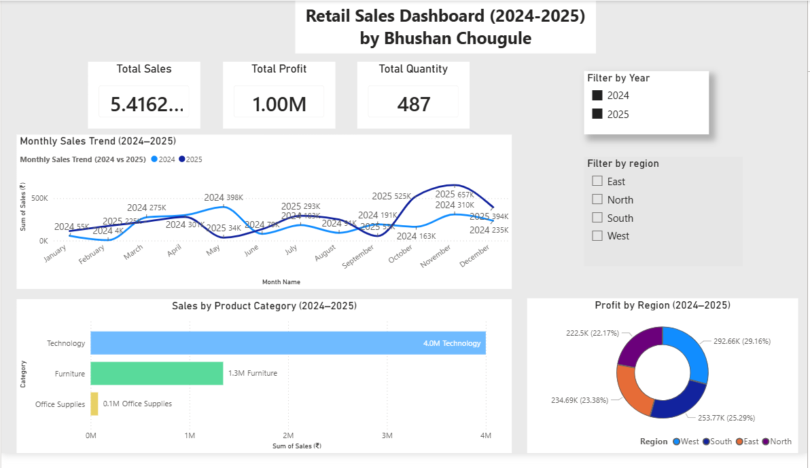

# Retail Sales Dashboard (2024–2025) 📊

## Project Overview
This project analyzes retail sales performance using a dashboard to understand trends, product category performance, and regional profit distribution.

The goal of this analysis is to help businesses make better decisions by understanding sales patterns and identifying top-performing categories and regions.

---

## Tools Used
- Power BI
- Excel
- Data Visualization
- Business Intelligence

---

## Key Metrics
The dashboard highlights the following KPIs:

• Total Sales  
• Total Profit  
• Total Quantity Sold  

---

## Dashboard Insights

### Monthly Sales Trend
The monthly trend chart compares sales performance for 2024 and 2025, helping identify seasonal patterns and growth periods.

### Sales by Product Category
Technology products generated the highest revenue, followed by Furniture and Office Supplies.

### Profit by Region
The profit distribution shows how different regions contribute to the overall profitability of the business.

### Filters
Users can filter the dashboard by:
- Year (2024 / 2025)
- Region (East, North, South, West)

---

## Key Business Insights
- Technology category generates the highest revenue (~4M).
- Sales increase significantly during October and November.
- West region contributes the highest profit.
- Office Supplies generate the lowest revenue.

---

## Dashboard Preview

---

## Author
Bhushan Chougule  
Data Analyst | Python | SQL | Power BI
